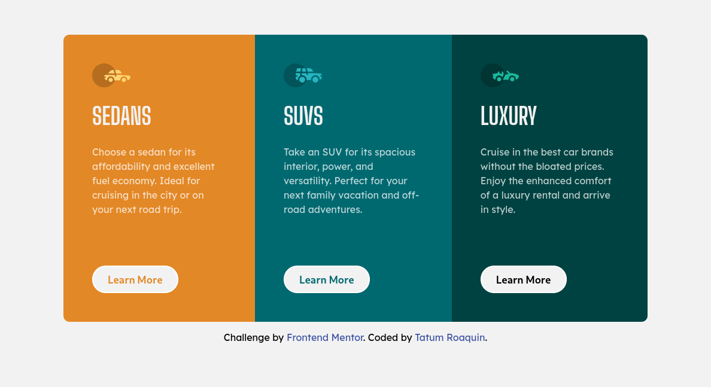

# Frontend Mentor - 3-column preview card component solution

This is a solution to the [3-column preview card component challenge on Frontend Mentor](https://www.frontendmentor.io/challenges/3column-preview-card-component-pH92eAR2-). Frontend Mentor challenges help you improve your coding skills by building realistic projects.

## Table of contents

- [Overview](#overview)
  - [The challenge](#the-challenge)
  - [Screenshot](#screenshot)
  - [Links](#links)
- [My process](#my-process)
  - [Built with](#built-with)
  - [What I learned](#what-i-learned)
- [Author](#author)

## Overview

### The challenge

Users should be able to:

- View the optimal layout depending on their device's screen size
- See hover states for interactive elements

### Screenshot

<div align="center">
    
    
</div>

### Links

- Solution URL: (https://github.com/tatumroaquin/frontendmentor.io/tree/main/01-newbie/3-column-preview-card-component#links)
- Live Site URL: (https://3-column-preview-card-022422.netlify.app/)

## My process

### Built with

- Semantic HTML5 markup
- CSS variables/custom properties
- Flexbox
- Desktop-first workflow

### What I learned

When changing `flex-direction` in `.container`, the element kept its position at the center as if it's absolute. The reason is the `height` property of the `.container` is not relative to the parent. In the media query I had to specify `height: 100%` to make the effect work.

```css
.container {
  width: 61rem;
  height: 30rem;
  display: flex;
}

@media only screen and (max-width: 730px) {
  .container {
    flex-direction: column;
    width: 90%;
    height: 100%;
    margin: 3rem auto;
  }
}
```

## Author

- Frontend Mentor - [@tatumroaquin](https://www.frontendmentor.io/profile/tatumroaquin)
