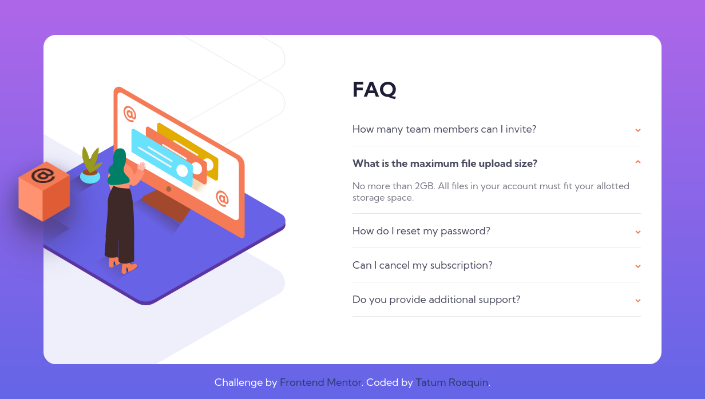

# Frontend Mentor - FAQ accordion card solution

This is a solution to the [FAQ accordion card challenge on Frontend Mentor](https://www.frontendmentor.io/challenges/faq-accordion-card-XlyjD0Oam). Frontend Mentor challenges help you improve your coding skills by building realistic projects.

## Table of contents

- [Overview](#overview)
  - [The challenge](#the-challenge)
  - [Screenshot](#screenshot)
  - [Links](#links)
- [My process](#my-process)
  - [Built with](#built-with)
  - [What I learned](#what-i-learned)
  - [Useful resources](#useful-resources)
- [Author](#author)

## Overview

### The challenge

Users should be able to:

- View the optimal layout for the component depending on their device's screen size
- See hover states for all interactive elements on the page
- Hide/Show the answer to a question when the question is clicked

### Screenshot

<div align="center">
    
    
</div>

### Links

- Solution URL: (https://your-solution-url.com)
- Live Site URL: (https://your-live-site-url.com)

## My process

### Built with

- Semantic HTML5 markup
- CSS variables/custom properties
- Flexbox
- Desktop-first workflow

### What I learned

#### Problem 1: Logic to close all accordions except the one in focus.

```javascript
const faqBlocks = document.querySelectorAll('.faq__block');
faqBlocks.forEach((block) => {
  block.addEventListener('toggle', (e) => {
    if (!block.open) return;

    faqBlocks.forEach((detail) => {
      if (detail.open && detail !== block) {
        detail.open = false;
      }
    });
  });
});
```

This code attaches a 'toggle' event listener to each `<details>` element. And closes all other accordions except the one that triggered the event.

The logic works but for some reason it randomly causes a flickering effect when opening or closing accordions. My theory is that because the 'toggle' event can be activate programmatically (`details.open = false`). It causes the event handler to trigger multiple times resulting in strange behaviours.

**Solution:**

```javascript
faq.forEach((block) => {
  block.addEventListener('click', () => {
    if (block.open) return;
    faq.forEach((detail) => (detail.open = false));
  });
});
```

I opted to use the `click` event instead so that the callback only triggers once, and only when the user clicks the element. But it is not without its quirks, the logic is reversed `block.open` returns `false` when the accordion is opened, and `true` when it is closed.

__Note:__ Another theory that I would like to mention is that I think that click event handler is executed before the event itself. That's why `details.open = false` does not close the currently clicked element.

#### Problem 2: Missing cube shadow

In the design images the `illustration-box-desktop.png` has a mild shadow behind it to accentuate the popup effect of the shape. But it was not visible enough given the background of the surrounding elements.

<div align='center'>

</div>

**Solution:**

```css
.card__image #box {
  /* ... */
  filter: drop-shadow(0 5mm 1rem var(--dark-desaturated-blue));
}
```

After a quick google search I found the `drop-shadow()` CSS function to increase the shadow effect.

<div align='center'>

</div>

### Useful resources
- [Stack Overflow - Automatically close all the other \<details\> tags after opening a specific \<details\> tag](https://stackoverflow.com/a/36994802)
- [Stack Overflow - Detecting the opening or closing of a details element](https://stackoverflow.com/a/36162564)
- [W3Schools - HTML open Attribute](https://www.w3schools.com/TAGS/att_open.asp)
- [Dev Community - What's the difference between : and :: in CSS?](https://dev.to/whitep4nth3r/whats-the-difference-between-and-in-css-23p4)
- [MDN Web Docs - drop-shadow()](https://developer.mozilla.org/en-US/docs/Web/CSS/filter-function/drop-shadow)

## Author

- Frontend Mentor - [@tatumroaquin](https://www.frontendmentor.io/profile/tatumroaquin)
