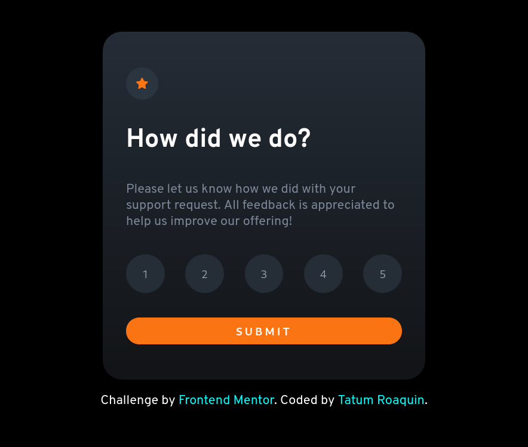
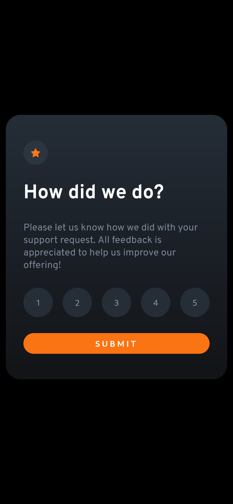

# Frontend Mentor - Interactive rating component solution

This is a solution to the [Interactive rating component challenge on Frontend Mentor](https://www.frontendmentor.io/challenges/interactive-rating-component-koxpeBUmI). Frontend Mentor challenges help you improve your coding skills by building realistic projects.

## Table of contents

- [Overview](#overview)
  - [The challenge](#the-challenge)
  - [Screenshot](#screenshot)
  - [Links](#links)
- [My process](#my-process)
  - [Built with](#built-with)
  - [What I learned](#what-i-learned)
  - [Useful resources](#useful-resources)
- [Author](#author)

### The challenge

Users should be able to:

- View the optimal layout for the app depending on their device's screen size
- See hover states for all interactive elements on the page
- Select and submit a number rating
- See the "Thank you" card state after submitting a rating

### Screenshot



<div align="center">
    
</div>

## Links

- Solution URL: (https://github.com/tatumroaquin/frontendmentor-interactive-rating-component)
- Live Site URL: (https://fm-interactive-rating-62f380.netlify.app)

## My process

### Built with

- Semantic HTML5 markup
- CSS variables/custom properties
- Flexbox
- Desktop-first workflow

### What I learned

At first I tried to use the `focus` state on an empty `li`, that obviously did not work so I used buttons instead.

```html
<ul class="rate__range">
  <li>
    <button class="rate__rangeitem">1</button>
  </li>
  <li>
    <button class="rate__rangeitem">2</button>
  </li>
  <li>
    <button class="rate__rangeitem">3</button>
  </li>
  <li>
    <button class="rate__rangeitem">4</button>
  </li>
  <li>
    <button class="rate__rangeitem">5</button>
  </li>
</ul>
```

To change hide and show elements I declared a `hidden` class to change the display of an element to `none`. I ensured that it is declared after the `card` related classes, otherwise it will be overridden by later declarations to the `display` attribute. If for some reason you wish to declare this class earlier use a precedence modifier like `!important`.

```css
.hidden {
  display: none;
}
```

To change the rating on the thank you card, I simply added event listeners to the buttons, and each of them will change the value to the `span` element on the `rating__result` block.

```js
const rateButtons = document.querySelectorAll('.rate__rangeitem');
const ratingValue = document.querySelector('.rating__value');

rateButtons.forEach((button) => {
  button.addEventListener('click', () => {
    ratingValue.innerHTML = button.innerHTML;
  });
});
```

### Useful resources

- [Example resource 1](https://www.example.com) - This helped me for XYZ reason. I really liked this pattern and will use it going forward.
- [Example resource 2](https://www.example.com) - This is an amazing article which helped me finally understand XYZ. I'd recommend it to anyone still learning this concept.## Author

## Author
- Frontend Mentor - [@tatumroaquin](https://www.frontendmentor.io/profile/tatumroaquin)
