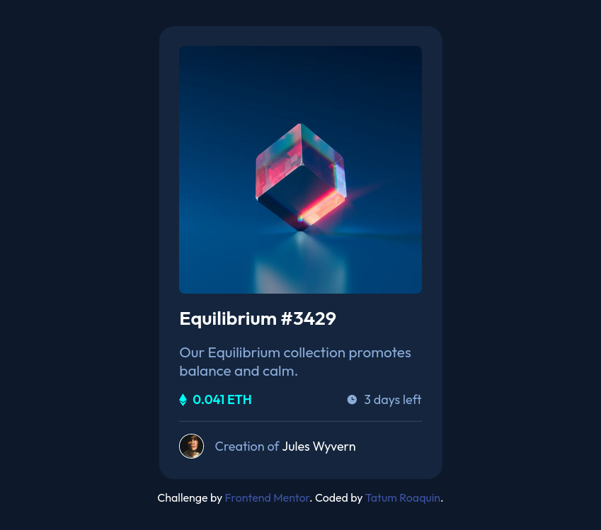

# Frontend Mentor - NFT preview card component solution

This is a solution to the [NFT preview card component challenge on Frontend Mentor](https://www.frontendmentor.io/challenges/nft-preview-card-component-SbdUL_w0U). Frontend Mentor challenges help you improve your coding skills by building realistic projects.

## Table of contents

- [Overview](#overview)
  - [The challenge](#the-challenge)
  - [Screenshot](#screenshot)
  - [Links](#links)
- [My process](#my-process)
  - [Built with](#built-with)
  - [What I learned](#what-i-learned)
- [Author](#author)

## Overview

### The challenge

Users should be able to:

- View the optimal layout depending on their device's screen size
- See hover states for interactive elements

### Screenshot



<div align="center">
    
</div>

### Links

- Solution URL: (https://github.com/tatumroaquin/frontendmentor-nft-preview-card-component)
- Live Site URL: (https://tatumroaquin.github.io/frontendmentor-nft-preview-card-component)

## My process

### Built with

- Semantic HTML5 markup
- CSS variables/custom properties
- Flexbox
- Desktop-first workflow

### What I learned

The hardest part of this design for me is showing a `cyan` background at a decreased opacity in combination with `icon-view.svg`.

The first markup structure I came up with is show below:

```html
<div class="nft__view">
  
</div>
```

But this did not work as per the reasons I stated above.

So I changed the markup to hold a `span` tag which would hold the background color value and opacity changes necessary. Without affecting the opacity level of the `icon-views.svg`, and it would remain at `opacity:100%`.

```html
<div class="nft__view">
  <span class="nft__view--bg"></span>
  
</div>
```

After that all I have to do is to hide the `.nft__view` class and show it when the user hover's the mouse on the `.nft__image`.

```css
.nft__view {
  display: none;
  position: absolute;
  top: 0;
  left: 0;
  width: 100%;
  height: 100%;
}
.nft__image:hover .nft__view {
  display: block;
}
```

In the deployment stage, the view the page in Chromium-based browsers will display the `hr` tag with a visibly white border (whoops!). I mainly used Firefox for development which is why I did not catch this in the development. Luckily it is a simple fix:

```css
hr {
  color: var(--line);
  background-color: var(--line);
  border-style: none;
  height: 2px;
}
```

## Author

- Frontend Mentor - [@tatumroaquin](https://www.frontendmentor.io/profile/tatumroaquin)
