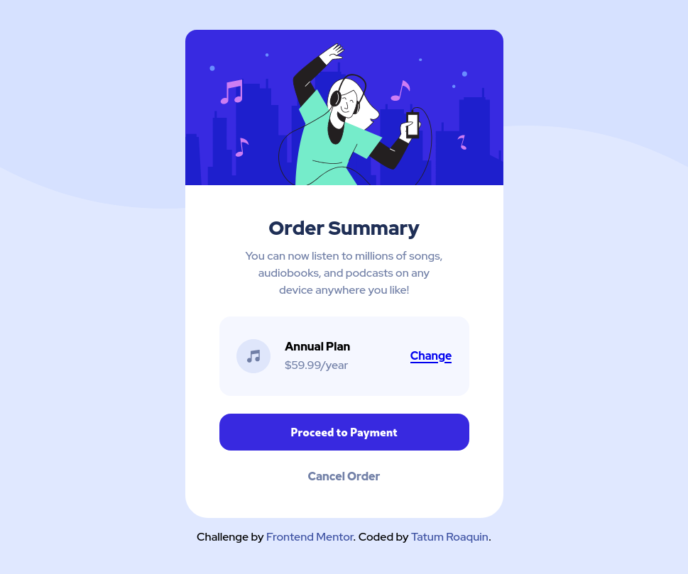

# Frontend Mentor - Order summary card solution

This is a solution to the [Order summary card challenge on Frontend Mentor](https://www.frontendmentor.io/challenges/order-summary-component-QlPmajDUj). Frontend Mentor challenges help you improve your coding skills by building realistic projects.

## Table of contents

- [Overview](#overview)
  - [The challenge](#the-challenge)
  - [Screenshot](#screenshot)
  - [Links](#links)
- [My process](#my-process)
  - [Built with](#built-with)
  - [What I learned](#what-i-learned)
  - [Useful resources](#useful-resources)
- [Author](#author)

## Overview

### The challenge

Users should be able to:

- See hover states for interactive elements

### Screenshot



<div align="center">
    
</div>

### Links

- Solution URL: (https://github.com/tatumroaquin/frontendmentor-order-summary-component/)
- Live Site URL: (https://fm-order-summary-c45e76.netlify.app)

## My process

### Built with

- Semantic HTML5 markup
- CSS variables/custom properties
- Flexbox
- Desktop-first workflow

### What I learned

I contemplated using another layer of divs to separate the `.card__image` from the rest of the elements in the `.card`. This is to remove padding from the `.card__image`, but I decided to just used negative margin's instead.

```css
.card {
  /* ... */
  padding: 3rem;
}
.card__image {
  margin: -3rem -3rem 2rem -3rem;
  width: calc(100% + 6rem);
  border-radius: 1rem 1rem 0 0;
}
```

The value `6rem` in `width: calc(100% + 6rem)` includes the left and right margins which are each `3rem`.

### Useful resources

- [HTML - Make Child Element Ignore Parent Div's Padding](https://stackoverflow.com/a/29381468) - Suggested the use of negative margins to ignore parent element's padding settings.

## Author

- Frontend Mentor - [@tatumroaquin](https://www.frontendmentor.io/profile/tatumroaquin)
