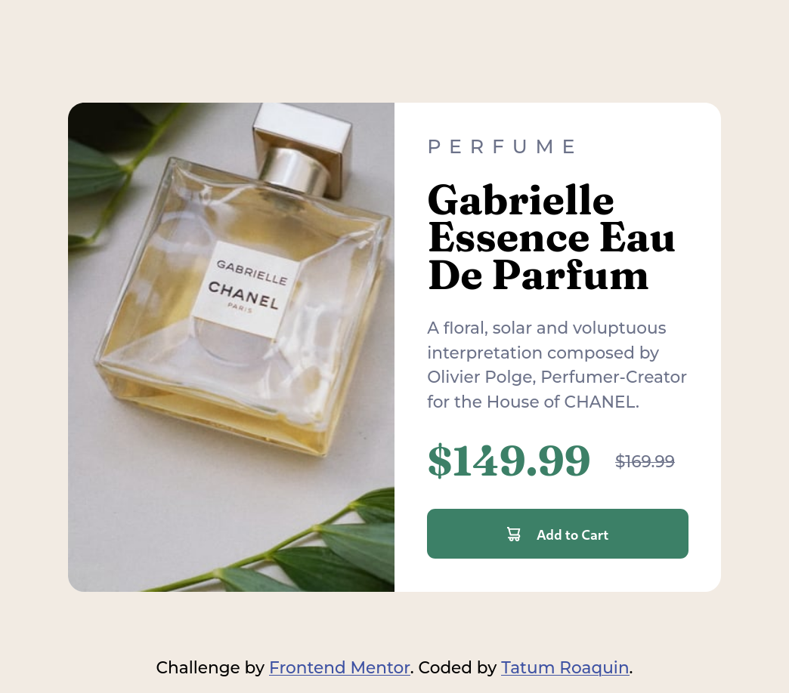
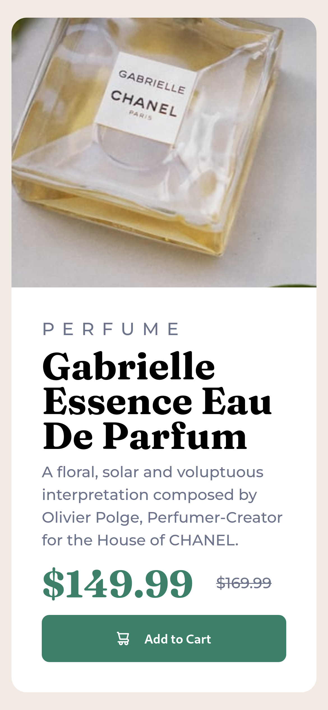

# Frontend Mentor - Product preview card component solution

This is a solution to the [Product preview card component challenge on Frontend Mentor](https://www.frontendmentor.io/challenges/product-preview-card-component-GO7UmttRfa). Frontend Mentor challenges help you improve your coding skills by building realistic projects. 

## Table of contents

- [Overview](#overview)
  - [The challenge](#the-challenge)
  - [Screenshots](#screenshots)
  - [Links](#links)
- [My process](#my-process)
  - [Built with](#built-with)
  - [What I learned](#what-i-learned)
  - [Useful resources](#useful-resources)
- [Author](#author)
## Overview

### The challenge

Users should be able to:

- View the optimal layout depending on their device's screen size
- See hover and focus states for interactive elements

### Screenshots



<div align="center">
    
</div>

### Links

- Solution URL: (https://github.com/tatumroaquin/frontendmentor-product-preview-card-component)
- Live Site URL: (https://fm-product-preview-card-41f97c.netlify.app)
## My process

### Built with

- Semantic HTML5 markup
- CSS variables/custom properties
- Flexbox
- Desktop-first workflow

### What I learned

When I was searching for a way to strike-through the original price tag. I accidentally found `letter-spacing` property and used that to space out the letters of the heading.

With `text-transform` to change the casing of the letters to uppercase, and instead of using the `img` element for the perfume. I learnt how to use `background-image` alignment with `background-position` and `background-size`.

```css
.perfume__heading {
  font-weight: 500;
  letter-spacing: 0.5rem;
  text-transform: uppercase;
  color: var(--dark-grayish-blue);
}

.price__original {
  color: var(--dark-grayish-blue);
  text-decoration: line-through;
}

.perfume__image {
  background-image: url('./images//image-product-desktop.jpg');
  background-position: center center;
  background-size: 100%;
  border-radius: 1rem 0 0 1rem;
  width: 50%;
  height: 100%;
}
```

### Useful resources

- [css text decoration](https://www.w3schools.com/Css/css_text_decoration.asp)
- [css text spacing](https://www.w3schools.com/Css/css_text_spacing.asp)
- [css text transform](https://www.w3schools.com/cssref/pr_text_text-transform.php)

## Author

- Frontend Mentor - [@tatumroaquin](https://www.frontendmentor.io/profile/tatumroaquin)
