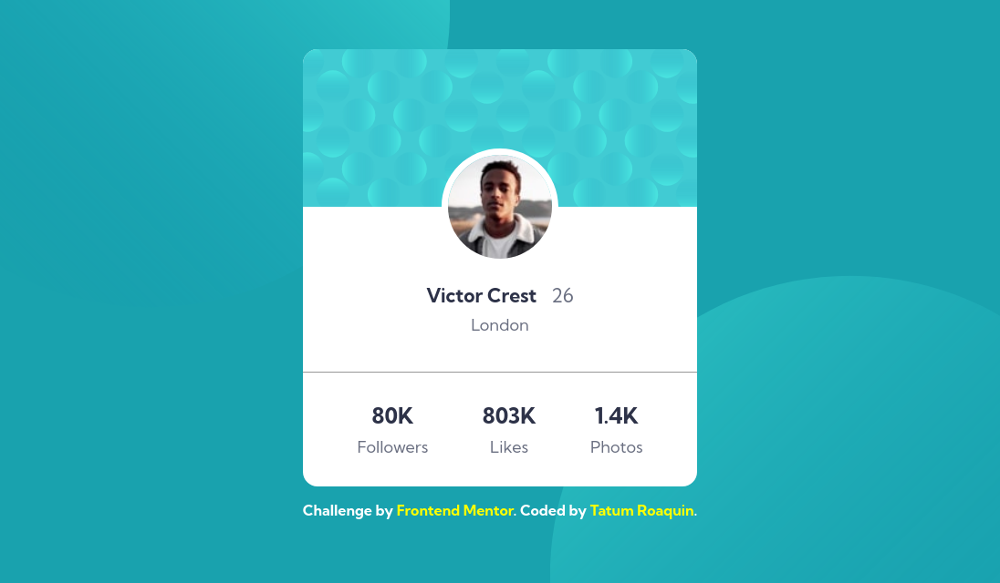
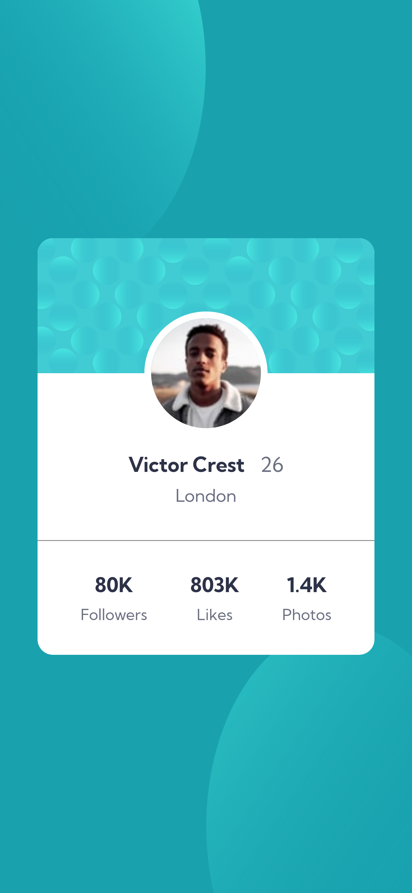

# Frontend Mentor - Profile card component solution

This is a solution to the [Profile card component challenge on Frontend Mentor](https://www.frontendmentor.io/challenges/profile-card-component-cfArpWshJ). Frontend Mentor challenges help you improve your coding skills by building realistic projects.

## Table of contents

- [Overview](#overview)
  - [The challenge](#the-challenge)
  - [Screenshot](#screenshot)
  - [Links](#links)
- [My process](#my-process)
  - [Built with](#built-with)
  - [What I learned](#what-i-learned)
  - [Useful resources](#useful-resources)
- [Author](#author)

## Overview

### The challenge

- Build out the project to the designs provided

### Screenshot

<div align="center">
    
    
</div>

### Links

- Solution URL: (https://www.frontendmentor.io/solutions/html-css-profile-card-component-Y98XJEC3EZ)
- Live Site URL: (https://fm-profile-card-3d9142.netlify.app/)

## My process

### Built with

- Semantic HTML5 markup
- CSS variables/custom properties
- Flexbox
- Desktop-first workflow

### What I learned

I found out that I can specify multiple `background-image` files and also set `background-repeat`, `background-size`, and `background-position` like so:

```css
body {
  /* ... */
  background-color: var(--dark-cyan);
  background-image: url('./images/bg-pattern-top.svg'),
    url('./images/bg-pattern-bottom.svg');
  background-repeat: no-repeat no-repeat;
  background-size: 60%, 60%;
  background-position: top -50vh left -15vw, bottom -50vh right -15vw;
}
```

### Useful resources

- [background-position - CSS: Cascading Style Sheets | MDN](https://developer.mozilla.org/en-US/docs/Web/CSS/background-position) - Documentation that I used to position the main background patterns.

## Author

- Frontend Mentor - [@tatumroaquin](https://www.frontendmentor.io/profile/tatumroaquin)
