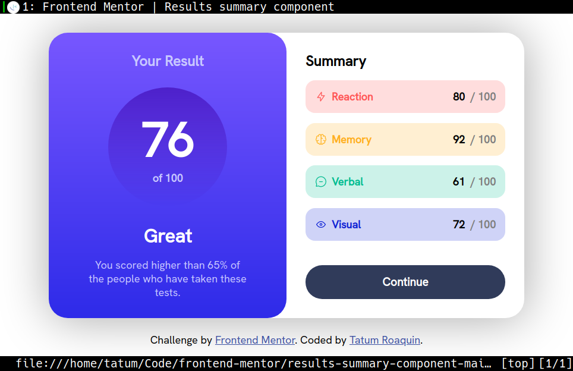
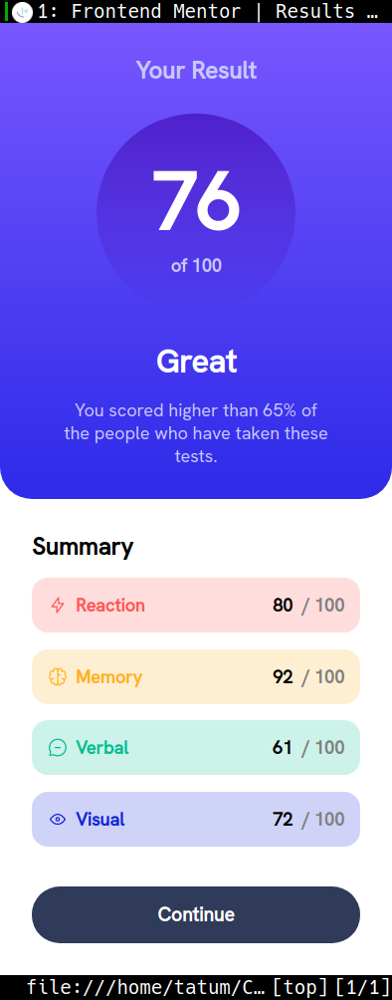

# Frontend Mentor - Results summary component solution

This is a solution to the [Results summary component challenge on Frontend Mentor](https://www.frontendmentor.io/challenges/results-summary-component-CE_K6s0maV). Frontend Mentor challenges help you improve your coding skills by building realistic projects. 

## Table of contents

- [Overview](#overview)
  - [The challenge](#the-challenge)
  - [Screenshots](#screenshots)
  - [Links](#links)
- [My process](#my-process)
  - [Built with](#built-with)
  - [What I learned](#what-i-learned)
  - [Useful resources](#useful-resources)
- [Author](#author)

## Overview

### The challenge

Users should be able to:

- View the optimal layout for the interface depending on their device's screen size
- See hover and focus states for all interactive elements on the page

### Screenshots

<div align="center">
    
    
</div>

### Links

- Solution URL: (https://www.frontendmentor.io/solutions/pure-html-css-js-solution-AndlO7hrG9)
- Live Site URL: (https://fm-results-summary-384c9b.netlify.app)

## My process

### Built with

- Semantic HTML5 markup
- CSS variables/custom properties
- Flexbox
- Desktop-first workflow


### What I learned

My goal was to animate the transition of the 'continue' button background from a solid color to a linear gradient.
I applied absolute positioning to align the span to the borders of button's content box.
Using a negative `z-index` to the span allows the linear gradient to become the backgroud of the button.
By default `z-index` has the value of `auto`, which would put that element at the top of the stack. 

```html
<button class="button__continue" type="button">
  <span class="button__background"></span>Continue
</button>
```
```css
.button__continue {
  position: relative;
  background: var(--neutral-dark-gray-blue);
  border-radius: 2rem 2rem 2rem 2rem;
  border-style: none;
  color: var(--neutral-white);
  cursor: pointer;
  display: inline-block;
  font-size: 1.2rem;
  font-weight: bold;
  padding: 1rem;
  margin-top: 1.5rem;
  z-index: 1;
}

.button__background {
  position: absolute;
  background-image: linear-gradient(
    var(--gradient-slate-blue),
    var(--gradient-royal-blue)
  );
  border-radius: inherit;
  top: 0;
  left: 0;
  opacity: 0;
  width: 100%;
  height: 100%;
  z-index: -1;

  transition: opacity 0.2s ease-in-out;
}

.button__continue:hover .button__background {
  opacity: 1;
}
```

### Useful resources

- [css transition with linear gradient](https://stackoverflow.com/a/7364325) - I had the idea of animating the 'continue' button from a solid color to a linear-gradient for the active styles. But I had difficulty implementing the delay, so I used this method instead to create the fade in effect I wanted.

## Author

- Frontend Mentor - [@tatumroaquin](https://www.frontendmentor.io/profile/tatumroaquin)
