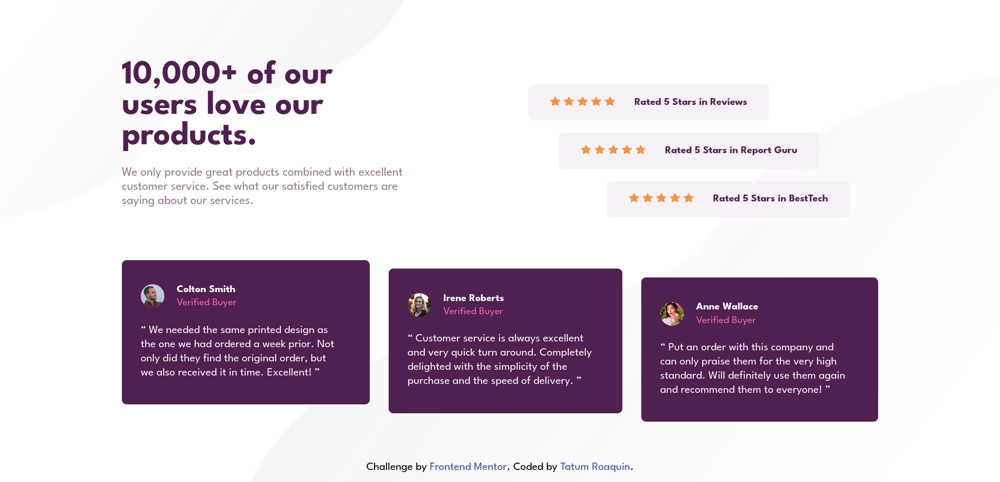
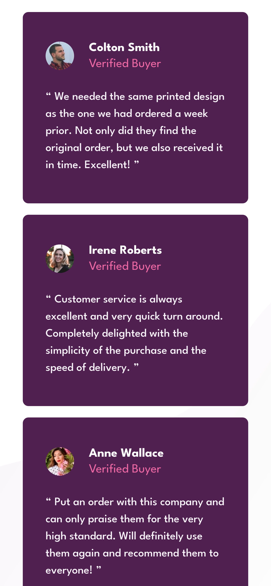

# Frontend Mentor - Social proof section solution

This is a solution to the [Social proof section challenge on Frontend Mentor](https://www.frontendmentor.io/challenges/social-proof-section-6e0qTv_bA). Frontend Mentor challenges help you improve your coding skills by building realistic projects.

## Table of contents

- [Overview](#overview)
  - [The challenge](#the-challenge)
  - [Screenshot](#screenshot)
  - [Links](#links)
- [My process](#my-process)
  - [Built with](#built-with)
  - [What I learned](#what-i-learned)
  - [Useful resources](#useful-resources)
- [Author](#author)

## Overview

### The challenge

Users should be able to:

- View the optimal layout for the section depending on their device's screen size

### Screenshot

<div align="center">
    
    
    
</div>

### Links

- Solution URL: (https://github.com/tatumroaquin/frontendmentor.io/tree/main/01-newbie/social-proof-section)
- Live Site URL: (https://social-proof-section-5b5cb5.netlify.app/)

## My process

### Built with

- Semantic HTML5 markup
- CSS variables/custom properties
- CSS Grid
- Flexbox
- Desktop-first workflow

### What I learned

#### Problem 1: Dividing the screen into three sections

After spending 10 mins looking at the design images for this challenge. It became clear that I would need CSS Grid for this, as doing this in pure Flexbox will just introduce unnecessary complexity.

**Solution:**

The format I came up with is to divide the screen in a `2x2` grid, with 2 rows and 2 columns each.

```css
.container {
  /* ... */
  display: grid;
  grid-template-columns: repeat(2, 1fr);
  grid-template-rows: repeat(2, 1fr);
}
```

In the top left is the `.social__advert`, in the top right is the `.social__ratings`, and in the bottom is the `social__reviews` spanning 2 columns.

#### Problem 2: Slanting each rating and review card components

My plan was to use flexbox for slanting each `card` component within their respective grid containers. Which mean that I had to select individual cards and align them differently.

**Solution:**

I didn't have much difficulty with this task, I knew that the `:nth-child()` selector existed. But I didn't know how to use it so after a quick google search I came up with:

```css
.ratings__card:nth-child(1) {
  align-self: flex-start;
  margin-left: 3rem;
}
.ratings__card:nth-child(2) {
  align-self: center;
}
.ratings__card:nth-child(3) {
  align-self: flex-end;
  margin-right: 3rem;
}
.review__card:nth-child(1) {
  align-self: flex-start;
}
.review__card:nth-child(2) {
  align-self: center;
}
.review__card:nth-child(3) {
  align-self: flex-end;
}
```

#### Problem 3: `.container` not responding to width changes

When specifying a static value for the `height` of an element, its position remains absolute when changes to the height or width is triggered by `@media` queries.

**Solution:**

To fix this simply specify a relative height so that the element moves itself in relation with the parent element.

```css
.container {
  height: 75vh;
}
@media only screen and (max-width: 60rem) {
  .container {
    height: 100%;
  }
}
```
---
The remaining time was spent making the mobile layout by switching to Flexbox, and using old CSS tricks.

### Useful resources

[Ohans Emmanuel - The CSS Fractional Unit (Fr) In Approachable, plain Language.](https://medium.com/flexbox-and-grids/the-css-fractional-unit-fr-in-approachable-plain-language-fdc47bd387f7)  
[MDN Web Docs - grid-template](https://developer.mozilla.org/en-US/docs/Web/CSS/grid-template)  
[MDN Web Docs - nth-child()](https://developer.mozilla.org/en-US/docs/Web/CSS/:nth-child)  
[MDN Web Docs - repeat()](https://developer.mozilla.org/en-US/docs/Web/CSS/repeat)  
[W3Schools - CSS grid-column Property](https://www.w3schools.com/cssref/pr_grid-column.php)  

## Author

- Frontend Mentor - [@tatumroaquin](https://www.frontendmentor.io/profile/tatumroaquin)
